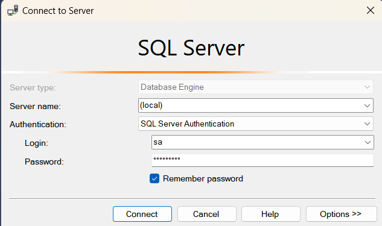

# Code Samples for MinimumApi
This is ASP.NET Core 8 Minimum API template project containing sample codes for:
- Route Setup *
- Swagger *
- Global Exception Handling *
- Development Exception handling is automatically turned on if the environment name is `Development` and using `WebApplication.CreateBuilder` 
- Problem Details *
- File Uploads *
- File Downloads *
- Cors *
- Authentication *
- Authorization *
  - Authentication and Authorization need to be added after Cors, 
  - For testing purpose the sample uses user-jwts, to create a token use: `dotnet user-jwts create --scope "greetings_api" --role "admin"`
  - then use `curl -i -H "Authorization: Bearer {token}" https://localhost:{port}/customers` to test the endpoint, remember to replace the token and port.
- JWT *
- Swagger JWT Authorization Integration *
- Endpoint grouping *
- Http Editor, .http files *
- OpenID Connect (OIDC)
- Object List To CSV Download
- Import CSV to Object List
- Unit Tests *
- NSubstitute *
- FluentAssertions *
- FluentValidation *
- Integraton Tests *
- Use Record type for Database object
- RepoDb (https://repodb.net/tutorial/get-started-sqlserver)  *
- Use Dapper
- GraphQL
- Add docker file
- Add CI/CD GitHub Action Integration 
- Add Azure Appplication Insight Integration
- Parameter validation (Fluent Validation)
- Add Code Coverage

#Notes
Run SQL-Server in Windows Docker Container: https://theserogroup.com/sql-server/getting-started-with-sql-server-in-a-docker-container/
- `docker pull mcr.microsoft.com/mssql/server:2019-latest`
- `docker run -e "ACCEPT_EULA=Y" -e "SA_PASSWORD=34r0TNhvgOde" -p 1433:1433 --name sql2019 -h sql2019 -d mcr.microsoft.com/mssql/server:2019-latest`
- - connect to the sql server instance on docker as normal, 
  
- Run bash script in container: `docker exec -it sql2019 /bin/bash`  (to exit, execute: `exit` command)
- Execute script in container from host: (example:create folder in container)
  `docker exec -it sql2019 mkdir /var/opt/mssql/backup`
- Copy file to container: `docker cp BaseballData.bak sql2019:/var/opt/mssql/backup`
- Stopping and starting a SQL Server Docker container: `docker start sql2019` and `docker stop sql2019`
- Run the following command in Azure Data Studio (or SQL Server Management Studio) to get a list of the database files for this database.
 `RESTORE FILELISTONLY FROM DISK = '/var/opt/mssql/backup/BaseballData.bak';`
- Run the following command in Azure Data Studio (or SQL Server Management Studio) to restore database
    `RESTORE DATABASE BaseballData 
    FROM DISK='/var/opt/mssql/backup/BaseballData.bak' 
    WITH MOVE 'Baseball' TO '/var/opt/mssql/data/Baseball.mdf', 
    MOVE 'Baseball_log' TO '/var/opt/mssql/data/Baseball_log.ldf';`

# Add validation filters, 
https://benfoster.io/blog/minimal-api-validation-endpoint-filters/
https://khalidabuhakmeh.com/minimal-api-validation-with-fluentvalidation
https://dotnetthoughts.net/working-model-validation-in-minimal-api/